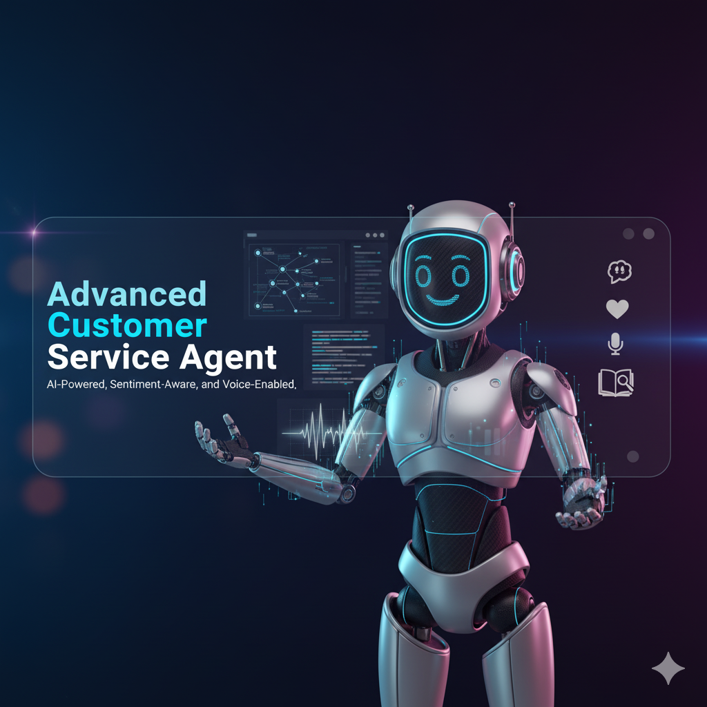
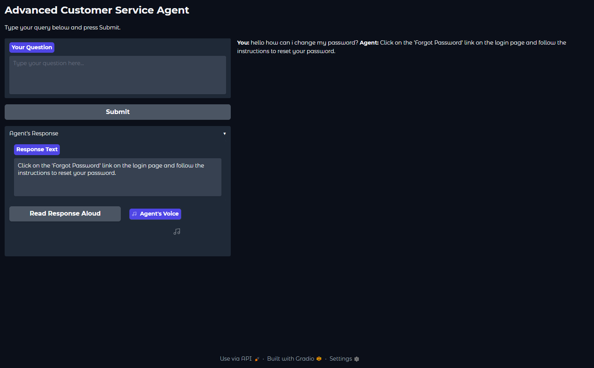

[](https://www.python.org/)[](https://pytorch.org/)[](LICENSE)

# 🤖 Advanced Customer Service Agent

An intelligent, multi-modal customer service agent built with a Retrieval-Augmented Generation (RAG) pipeline. This agent can understand user sentiment, retrieve relevant information from a knowledge base, and provide empathetic, context-aware responses in both text and voice.

the gradio demo can be found [Here](https://huggingface.co/datasets/MakTek/Customer_support_faqs_dataset)



---

## 📋 Table of Contents

- [📖 About The Project](#-about-the-project)
- [✨ Features](#-features)
- [🛠️ Tech Stack & Model Architecture](#️-tech-stack--model-architecture)
  - [Model Selection Rationale](#model-selection-rationale)
- [📊 Performance Benchmark](#-performance-benchmark)
- [🔮 Future Improvements](#-future-improvements)
- [🚀 Getting Started](#-getting-started)
  - [Prerequisites](#prerequisites)
  - [Installation & Usage](#installation--usage)

---

## 📖 About The Project

This project is a complete implementation of an advanced AI customer service agent. The core of the agent is a RAG pipeline that allows it to answer user queries based on a predefined knowledge base, ensuring factual and relevant responses. It includes conversation memory to handle follow-up questions and sentiment analysis to adapt its tone, making the interaction feel more natural and empathetic.

---

## ✨ Features

- **🧠 Conversation Memory**: Remembers previous turns in the conversation to understand context.
- **😠 Sentiment-Aware**: Detects user sentiment (Positive/Negative) and adjusts its persona to be more helpful or empathetic.
- **📚 Retrieval-Augmented Generation (RAG)**: Retrieves relevant information from a vector database to provide accurate, knowledge-based answers.
- **🔊 Text-to-Speech**: Can read its responses aloud for a complete voice-enabled experience.
- **🌐 Interactive UI**: Built with Gradio for an easy-to-use web interface.

---

## 🛠️ Tech Stack & Model Architecture

The agent is built on a modern RAG architecture using the Hugging Face ecosystem.

1. **User Query**: The user asks a question.
2. **Sentiment Analysis**: The query's sentiment is analyzed.
3. **Embedding & Retrieval**: The query is converted into a vector embedding. This embedding is used to search a FAISS vector database to find the most relevant documents from the knowledge base.
4. **Prompt Engineering**: A detailed prompt is constructed containing the agent's persona (based on sentiment), the conversation history, the retrieved documents (context), and the user's current query.
5. **LLM Response Generation**: The complete prompt is sent to the LLM, which generates a context-aware and tonally appropriate response.
6. **Text-to-Speech**: The final text response can be converted to audio.

### Model Selection Rationale

| Component | Model | Reason for Choice |
| :--- | :--- | :--- |
| **Embedding** | `sentence-transformers/all-MiniLM-L6-v2` | A very lightweight and fast model that provides excellent performance for semantic retrieval. It's ideal for creating knowledge base embeddings without requiring massive computational resources. |
| **Response Generation** | `google/flan-t5-large` | We chose this model after benchmarking it against the smaller `flan-t5-base`. While slower, `flan-t5-large` is significantly better at following complex instructions, such as adopting an empathetic persona. This was crucial for handling negative user sentiment effectively. |
| **Sentiment Analysis** | `distilbert-base-uncased-finetuned-sst-2-english` | A small, fast, and accurate sentiment classifier. Its efficiency ensures that adding sentiment awareness doesn't create a bottleneck in the response pipeline. |
| **Text-to-Speech** | `gTTS` (Google Text-to-Speech) | Chosen for its simplicity and reliability. It's very easy to implement and works consistently across different environments, making it perfect for this project. |

---

## 📊 Performance Benchmark

A key decision in this project was selecting the right LLM for response generation. We tested two models on a Google Colab CPU environment to measure the trade-off between response time and quality.

| Model | Average Response Time (Colab CPU) | Response Quality |
| :--- | :--- | :--- |
| `google/flan-t5-base` | ~4 seconds | Fast, but often ignored persona instructions and provided blunt, unhelpful answers to negative queries. |
| `google/flan-t5-large` | ~20 seconds | Significantly slower, but consistently followed the empathetic persona instructions, leading to much higher-quality, more appropriate responses. |

**Conclusion**: We chose `flan-t5-large` because the improvement in response quality and instruction-following was critical for the agent's primary function, justifying the longer response time for a portfolio demonstration.

---

## 🔮 Future Improvements

While this project is a fully functional proof-of-concept, there are several ways it could be enhanced for a production environment:

- **📈 Scale the LLM**: For even higher quality responses and more nuanced conversations, we could upgrade to a much larger model (e.g., Llama 3, Mistral Large). This would require a more powerful GPU for inference to maintain an acceptable response time.

- **🎯 Customize the Knowledge Base**: Instead of a generic FAQ dataset [(MakTek/Customer_support_faqs_dataset)](https://huggingface.co/datasets/MakTek/Customer_support_faqs_dataset), the agent could be provided with a company's internal documentation, product manuals, or past support tickets. This would make it a highly specialized and valuable internal tool.

- **⚙️ Fine-Tune the Embedding Model**: For a highly specific domain (e.g., medical or legal support), the `all-MiniLM-L6-v2` embedding model could be fine-tuned on domain-specific text to improve the accuracy of the document retrieval step.

- **🗣️ Higher-Quality TTS**: While `gTTS` is reliable, we could integrate a more advanced, natural-sounding TTS model (like those from Coqui AI or Microsoft) for a more polished user experience.

- **🎤 Add Speech-to-Text (STT)**: Re-integrate a robust STT model (like `openai/whisper`) to create a full voice-to-voice conversation flow, allowing users to speak their queries directly to the agent.

- **🐳 Dockerize for Deployment**: The application could be containerized using Docker, making it easy to deploy consistently across different environments, from local machines to cloud servers.

---

## 🚀 Getting Started

Follow these steps to get the agent running locally.

### Prerequisites

You need to have Python 3.8+ installed on your system.

### Installation & Usage

1. **Clone the repository (or download the files):**

    ```sh
    git clone <your-repo-url>
    cd <your-repo-directory>
    ```

2.  **Install the dependencies:**
    ```sh
    pip install -r requirements.txt
    ```

3.  **Run the terminal-based demo (optional):**
    To see the core agent logic in action, run the `agent.py` script.
    ```sh
    python agent.py
    ```
